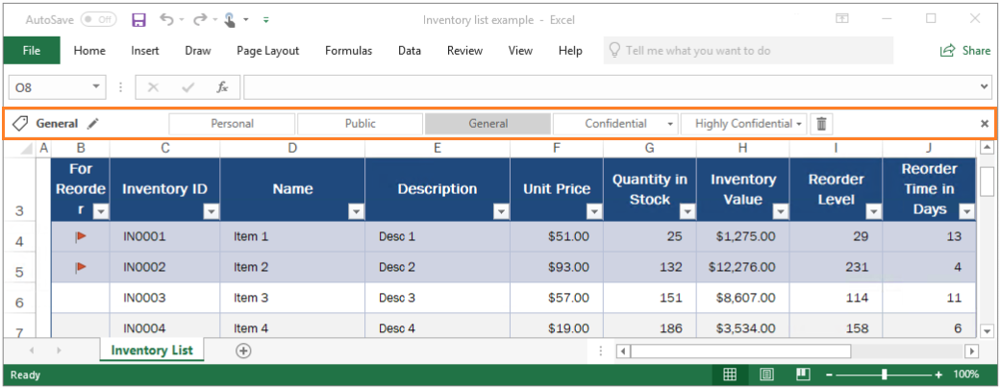
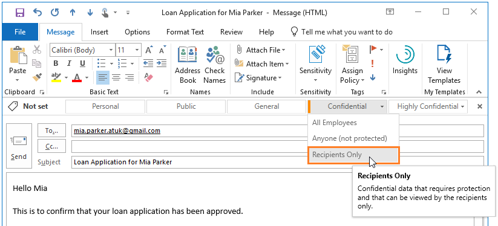

---
# required metadata

title: Azure Information Protection (AIP) labeling, classification, and protection
description: Learn how Azure Information Protection (AIP) can label documents and emails to classify and protect your data.
author: batamig
ms.author: bagol
manager: rkarlin
ms.date: 09/14/2020
ms.topic: conceptual
ms.collection: M365-security-compliance
ms.service: information-protection
Customer intent: As an administrator, I want to label documents and emails to classify and protect my organization's data, wherever it resides.

# optional metadata

#ROBOTS:
#audience:
#ms.devlang:
#ms.reviewer: eymanor
#ms.suite: ems
#ms.tgt_pltfrm:
ms.custom: admin
search.appverid:
- MET150

---

# Azure Information Protection (AIP) labeling, classification, and protection

>***Applies to**: [Azure Information Protection](https://azure.microsoft.com/pricing/details/information-protection)*

> ***Relevant for**: [Azure Information Protection unified labeling client and classic client for Windows](faqs.md#whats-the-difference-between-the-azure-information-protection-classic-and-unified-labeling-clients)*

>[!NOTE] 
> To provide a unified and streamlined customer experience, **Azure Information Protection classic client** and **Label Management** in the Azure Portal are being **deprecated** as of **March 31, 2021**. This time-frame allows all current Azure Information Protection customers to transition to our unified labeling solution using the Microsoft Information Protection Unified Labeling platform. Learn more in the official [deprecation notice](https://aka.ms/aipclassicsunset).

Azure Information Protection (AIP) is a cloud-based solution that enables organizations to classify and protect documents and emails by applying labels. 

For example, your administrator might configure a label with rules that detect sensitive data, such as credit card information. In this case, any user who saves credit card information in a Word file might see a tooltip at the top of the document with a recommendation to apply the relevant label for this scenario.

Labels can both [classify](#how-labels-apply-classification-with-aip), and optionally [protect](#how-aip-protects-your-data) your documents, enabling you to:

- **Track and control** how your content is used
- **Analyze data flows** to gain insight into your business
**- Detect risky behaviors** and take corrective measures
- **Track document access** and prevent data leakage or misuse
- And more ...

## How labels apply classification with AIP

Labeling your content with AIP includes:

- **Classification** that can be detected regardless of where the data is stored or with whom it's shared.
- **Visual markings,** such as headers, footers, or watermarks.
- **Metadata,** added to files and email headers in clear text. The clear text metadata ensures that other services can identify the classification and take appropriate action

For example, in the image below, labeling has classified an email message as *General*:

:::image type="content" source="media/example-email-footerv2.png" alt-text="Sample email footer and headers showing Azure Information Protection classification":::

In this example, the label also:

- **Added a footer of *Sensitivity: General* to the email message.** This footer is a visual indicator for all recipients that it's intended for general business data that should not be sent outside of the organization.
- **Embedded metadata in the email headers.** Header data enables email services can inspect the label and theoretically create an audit entry or prevent it from being sent outside of the organization.

Labels can be applied automatically by administrators using rules and conditions, manually by users, or using a combination where administrators define the recommendations shown to users.

## How AIP protects your data

Azure Information Protection uses the [*Azure Rights Management service* (Azure RMS)](what-is-azure-rms.md) to protect your data. 

Azure RMS is integrated with other Microsoft cloud services and applications, such as Office 365 and Azure Active Directory, and can also be used with your own or third-party applications and information protection solutions. Azure RMS works with both on-premises and cloud solutions.

Azure RMS uses encryption, identity, and authorization policies. Similar to AIP labels, protection applied using Azure RMS stays with the documents and emails, regardless of the document or email's location, ensuring that you stay in control of your content even when it's shared with other people.

Protection settings can be:

- **Part of your label configuration,** so that users both classify and protect documents and emails simply by applying a label. 
- **Used on their own,** by applications and services that support protection but not labeling. 

    For applications and services that support protection only, protection settings are used as [Rights Management templates](#rights-management-templates).

For example, you may want to configure a report or sales forecast spreadsheet so that it can be accessed only by people in your organization. In this case, you'd apply protection settings to control whether that document can be edited, restrict it to read-only, or prevent it from being printed.

Emails can have similar protection settings to prevent them from being forwarded or from using the Reply All option.

### Rights Management templates

As soon as the Azure Rights Management service is activated, two default rights management templates are available for you to restrict data access to users within your organization. Use these templates immediately, or configure your own protection settings to apply more restrictive controls in new templates.

Rights Management templates can be used with any applications or services that support Azure Rights Management.

The following image shows an example from the Exchange admin center, where you can configure Exchange Online mail flow rules to use RMS templates:

:::image type="content" source="media/templates-exchangeonline-callouts.png" alt-text="Example of selecting templates for Exchange Online":::

> [!NOTE]
> Creating an AIP label that includes protection settings also creates a corresponding Rights Management template that can be used separately from the label. 
>  

For more information, see [What is Azure Rights Management?](what-is-azure-rms.md)

## AIP and end-user integration for documents and emails

The AIP client installs the Information Protection bar to Office applications and enables end users to integrate AIP with their documents and emails.

For example, in Excel:

While labels can be applied automatically to documents and emails, removing guesswork for users or to comply with an organization's policies, the Information Protection bar enables end users to select labels and apply classification on their own.

Additionally, the AIP client enables users to classify and protect additional file types, or multiple files at once, using the right-click menu from Windows File Explorer. For example:

:::image type="content" source="media/right-click-classify-protect-folder.png" alt-text="File Explorer right-click Classify and protect using Azure Information Protection":::

The **Classify and protect** menu option works similarly to the Information Protection bar in Office applications, enabling users to select a label or set custom permissions.

> [!TIP]
> Power users or administrators might find that PowerShell commands are more efficient for managing and setting classification and protection for multiple files. [Relevant PowerShell commands](https://docs.microsoft.com/powershell/module/azureinformationprotection) are included with the client, and can also be installed separately.

Users and administrators can use document tracking sites to monitor protected documents, watch who accesses them, and when. If they suspect misuse, they can also revoke access to these documents. For example:

### Additional integration for email

Using AIP with Exchange Online provides the additional benefit of sending protected emails to any user, with the assurance that they can read it on any device.

For example, you may need to send sensitive information to personal email addresses that use a **Gmail**, **Hotmail**, or **Microsoft** account, or to users who don't have an account in Office 365 or Azure AD. These emails should be encrypted at rest and in transit, and be read only by the original recipients.

This scenario requires [Office 365 Message Encryption capabilities](https://techcommunity.microsoft.com/t5/Security-Privacy-and-Compliance/Email-Encryption-and-Rights-Protection/ba-p/110801). If the recipients cannot open the protected email in their native email client, they can use a one-time passcode to read the sensitive information in a browser.

For example, a Gmail user might see the following prompt in an email message they receive:

:::image type="content" source="media/ome-message.png" alt-text="Gmail recipient experience for OME and AIP":::

For the user sending the email, the actions required are the same as for sending a protected email to a user in their own organization. For example, select the **Do Not Forward** button that the AIP client can add to the Outlook ribbon. 

Alternately, **Do Not Forward** functionality can be integrated into a label that users can select to apply both classification and protection to that email. For example:

Administrators can also automatically provide protection for users by configuring mail flow rules that apply rights protection.

Any Office documents attached to these emails are automatically protected as well.

## Scanning for existing content to classify and protect

Ideally, you'll be labeling documents and emails as they're created. However, you likely have many existing documents, stored either on-premises or in the cloud, and want to classify and protect these documents as well.

Use one of the following methods to classify and protect existing content:

- **On-premises storage**: Use the [Azure Information Protection scanner](deploy-aip-scanner.md) to discover, classify, and protect documents on network shares and Microsoft SharePoint Server sites and libraries.

    The scanner runs as a service on Windows Server, and uses the same policy rules to detect sensitive information and apply specific labels to documents. 

    Alternately, use the scanner to apply a default label to all documents in a data repository without inspecting the file contents. Use the scanner in reporting mode only to discover sensitive information that you might not know you had.

- **Cloud data storage**: Use [Microsoft Cloud App Security](https://docs.microsoft.com/cloud-app-security/azip-integration) to apply your labels to documents in Box, SharePoint, and OneDrive. For a tutorial, see [Automatically apply Azure Information Protection classification labels](https://docs.microsoft.com/cloud-app-security/use-case-information-protection) 

## Next steps

Configure and see Azure Information Protection for yourself with our quickstart and tutorials:

- [Quickstart: Deploy the unified labeling client](quickstart-deploy-client.md)
- [Tutorial: Installing the Azure Information Protection (AIP) unified labeling scanner](tutorial-install-scanner.md)
- [Tutorial: Finding your sensitive content with the Azure Information Protection (AIP) scanner](tutorial-scan-networks-and-content.md)
- [Tutorial: Preventing oversharing in Outlook using Azure Information Protection (AIP)](tutorial-preventing-oversharing.md)

If you're ready to deploy this service for your organization, head over to the [how-to guides](how-to-guides.md).
