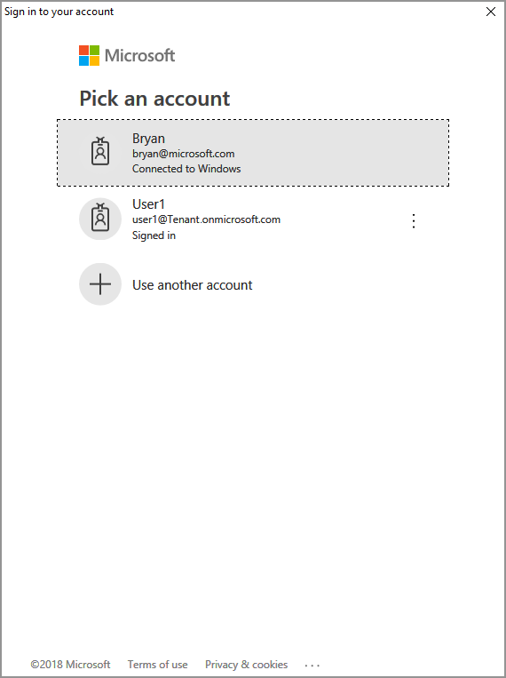

# Quickstart: List sensitivity labels (C#)

This Quickstart shows you how to use the MIP File SDK to list the sensitivity labels configured for your organization.

## Prerequisites

If you haven't already, be sure to complete the following prerequisites before continuing:

- Complete [Quickstart: Client application initialization (C#)](quick-app-initialization-csharp.md) first, which builds a starter Visual Studio solution. This "List sensitivity labels" Quickstart relies on the previous one, for proper creation of the starter solution.
- Optionally: Review [Classification labels](concept-classification-labels.md) concepts.

## Add logic to list the sensitivity labels

Add logic to list your organization's sensitivity labels, using the File engine object.

1. Open the Visual Studio solution you created in the previous "Quickstart: Client application initialization (C#)" article.

2. Using **Solution Explorer**, open the .cs file in your project that contains the implementation of the `Main()` method. It defaults to the same name as the project containing it, which you specified during project creation.

3. Toward the end of the `Main()` body, above the application shutdown section of the `Main()` function (where you left off in the previous Quickstart), insert the following code:

  ```csharp
  // List sensitivity labels from fileEngine and display name and id
  foreach(var label in fileEngine.SensitivityLabels)
  {
      Console.WriteLine(string.Format("{0} : {1}", label.Name, label.Id));

      if (label.Children.Count != 0)
      {
          foreach (var child in label.Children)
          {
              Console.WriteLine(string.Format("{0}{1} : {2}", "\t",child.Name, child.Id));
          }
      }
  }
  ```

## Build and test the application

Finally, build and test your client application.

1. Use CTRL-SHIFT-B (**Build Solution**) to build your client application. If you have no build errors, use F5 (**Start debugging**) to run your application.

2. If your project builds and runs successfully, the application *may* prompt for authentication via ADAL each time the SDK calls your `AcquireToken()` method. If cached credentials already exist, you won't be prompted to sign in and see the list of labels.

     [](media/quick-file-list-labels-cpp/acquire-token-sign-in.png#lightbox)

   - You may also need to give consent, to allow the application to access the MIP APIs, while running under the sign-in account. This happens when the Azure AD application registration isn't pre-consented (as outlined in "MIP SDK setup and configuration"), or you're signing in with an account from a different tenant (other than the one where your application is registered). Simply click **Accept** to record your consent.

     [](media/quick-file-list-labels-cpp/acquire-token-sign-in-consent.png#lightbox)

3. After authentication, your console output should show the sensitivity labels, similar to the following example:

  ```console
  Personal : 73c47c6a-eb00-4a6a-8e19-efaada66dee6
  Public : 73254501-3d5b-4426-979a-657881dfcb1e
  General : da480625-e536-430a-9a9e-028d16a29c59
  Confidential : 569af77e-61ea-4deb-b7e6-79dc73653959
        Recipients Only (C) : d98c4267-727b-430e-a2d9-4181ca5265b0
        All Employees (C) : 2096f6a2-d2f7-48be-b329-b73aaa526e5d
        Anyone (not protected) (C) : 63a945ec-1131-420d-80da-2fedd15d3bc0
  Highly Confidential : 905845d6-b548-439c-9ce5-73b2e06be157
        Recipients Only : 05ee72d9-1a75-441f-94e2-dca5cacfe012
        All Employees : 922b06ef-044b-44a3-a8aa-df12509d1bfe
        Anyone (not protected) : c83fc820-961d-40d4-ba12-c63f72a970a3
  Press a key to continue.
  ```

   > [!NOTE]
   > Copy and save the ID of one or more of the sensitivity labels (for example, `f42a3342-8706-4288-bd31-ebb85995028z`), as you will use it in the next Quickstart.

## Troubleshooting

### Problems during execution of C# application

| Summary | Error message | Solution |
|---------|---------------|----------|
| Bad access token | *An exception occurred... is the access token incorrect/expired?<br><br>Failed API call: profile_add_engine_async Failed with: [class mip::PolicySyncException] Failed acquiring policy, Request failed with http status code: 401, x-ms-diagnostics: [2000001;reason="OAuth token submitted with the request cannot be parsed.";error_category="invalid_token"], correlationId:[35bc0023-3727-4eff-8062-000006d5d672]'<br><br>C:\VSProjects\MipDev\Quickstarts\AppInitialization\x64\Debug\AppInitialization.exe (process 29924) exited with code 0.<br><br>Press any key to close this window . . .* | If your project builds successfully, but you see output similar to the left, you likely have an invalid or expired token in your `AcquireOAuth2Token()` method. Go back to [Build and test the application](#build-and-test-the-application) and regenerate the access token, update `AcquireOAuth2Token()` again, and rebuild/retest. You can also examine and verify the token and its claims, using the [jwt.ms](https://jwt.ms/) single-page web application. |
| Sensitivity labels aren't configured | n/a | If your project builds successfully, but you have no output in the console window, be sure your organization's sensitivity labels are configured correctly. See [MIP SDK setup and configuration](setup-configure-mip.md), under "Define label taxonomy and protection settings" for details.  |

## Next Steps

Now that you've learned how to list the sensitivity labels for your organization, try the next quickstart:

> [!div class="nextstepaction"]
> [Set and get a sensitivity label](quick-file-set-get-label-csharp.md)
